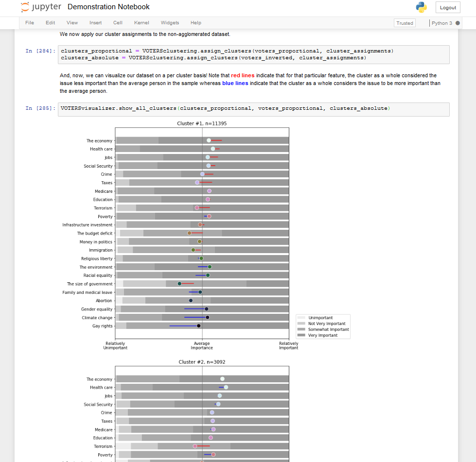

# Cluster Analysis of the "Views of the Electorate Research Survey" (VOTERS) dataset

This directory contains Python code and a demonstration notebook for doing a machine learning clustering analysis of Democracy Fund's [Views of the Electorate Research Survey (VOTERS)](https://www.voterstudygroup.org/publication/2018-voter-survey-1).

If you are unable to run Jupyter notebooks on your computer, a non-interactive HTML version of the Demonstration Notebook is available in the directory. And, if you read plain English better than Python, I have [a Medium essay](https://medium.com/@kalebnyquist/americas-clustered-consensus-6a1a714a286e?source=friends_link&sk=5da58f4b54ac5cc4ffe8d8c82282abb3) that gives an abbreviated description of this project's methodology and demonstrates some of the potential value this analysis might provide for political science and policy entrepreneurs.

Questions/comments/corrections: [email Kaleb Nyquist](mailto:contact@kalebnyquist.me)

